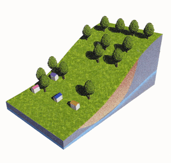
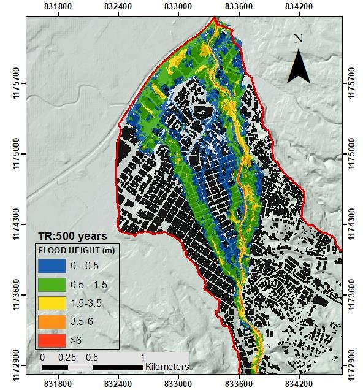

# felwind14.github.io
My personal website

My Name is Felipe Fonseca I am a Civil Engineer from [National University of Colombia](https://unal.edu.co/) and a Disaster Risk Reduction professional from [University of Twente](https://www.itc.nl/education/studyfinder/geo-information-science-earth-observation/specialisation/natural-hazards-and-disaster-risk-reduction/) (Netherlands). 

<!--  -->
<!--  -->

<!-- 

 
 -->

<!-- in case hyperlinks dont work -->

<!--
Landslide          |  Debris Flow
:-------------------------:|:-------------------------:
  |  
-->

 Landslide          |  Debris Flow
:-------------------------:|:-------------------------:
  |  